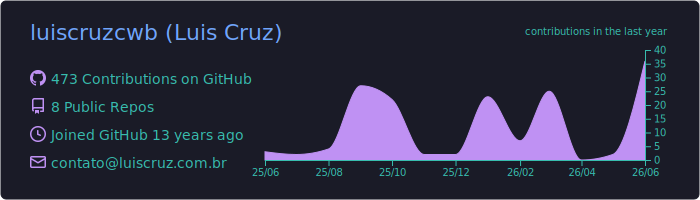
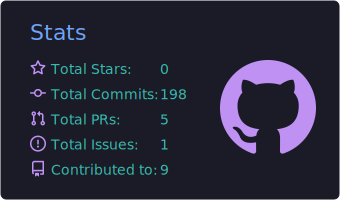
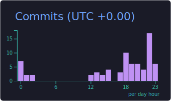
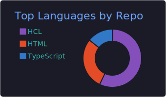
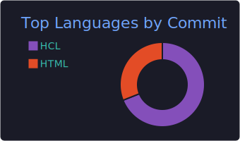

<h1 align="center">Olá, eu sou o Luis Cruz 👋</h1>

  <b>Analista de Infraestrutura · DevOps & SRE</b> 
  Infraestrutura como Código · GitOps · Observabilidade · Automação de Homelab

  
  
  

---

### 🚀 Sobre mim

Atuo com **infraestrutura e DevOps**, com foco em transformar ambientes manuais em pipelines **automatizados, versionados e observáveis**. Boa parte do que estudo nasce e é validado no meu **homelab Proxmox**, gerido inteiramente via **GitOps** (Terraform + Ansible + GitHub Actions).

- 🔭 Trabalhando com **IaC** (Terraform/Ansible), **observabilidade** (Prometheus, Grafana, Zabbix) e **gestão de segredos** (Vault).
- 🏠 Mantenho um cluster **Proxmox** automatizado de ponta a ponta — provisionamento, configuração e deploy declarativos.
- ✍️ Escrevo sobre essas experiências no [dev.to/luiscruzcwb](https://dev.to/luiscruzcwb).
- 📫 Contato: **contato@luiscruz.com.br**

---

### 🛠️ Stack & Ferramentas

**Cloud & Virtualização**

  
  
  

**Infraestrutura como Código & Automação**

  
  
  
  

**Containers**

  
  
  

**Observabilidade**

  
  
  
  

**Redes & Segurança**

  
  
  

---

### 📌 Projetos em destaque

| Projeto | Descrição |
|---------|-----------|
| 🏗️ [homelab-infrastructure-template](https://github.com/luiscruzcwb/homelab-infrastructure-template) | Template de automação Proxmox com **GitOps**, Terraform e GitHub Actions |
| 📊 [pve-homelab-monitoramento](https://github.com/luiscruzcwb/pve-homelab-monitoramento) | Stack de **observabilidade** (Prometheus + Grafana + InfluxDB) provisionada via IaC |
| 🔐 [pve-homelab-grav-cms](https://github.com/luiscruzcwb/pve-homelab-grav-cms) | Deploy de CMS com gestão segura de segredos via **HashiCorp Vault** |
| 🧭 [case-sre-observabilidade](https://github.com/luiscruzcwb/case-sre-observabilidade) | Case study **SRE**: SLOs, resposta a incidente e FinOps |

---

### 📈 GitHub Stats

  

  
  

  
  

📌 Cards gerados automaticamente via GitHub Actions — sempre disponíveis, sem depender de serviços externos.

---

### ✍️ Blog

📚 Escrevo sobre infraestrutura, DevOps e homelab em **[dev.to/luiscruzcwb](https://dev.to/luiscruzcwb)**.

  

